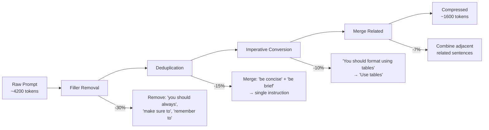
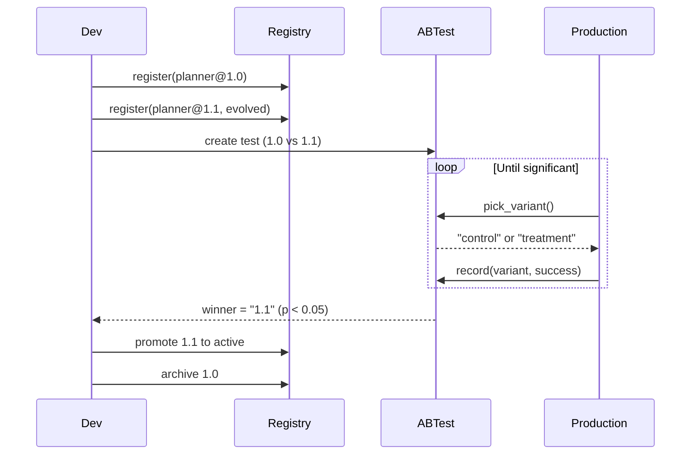
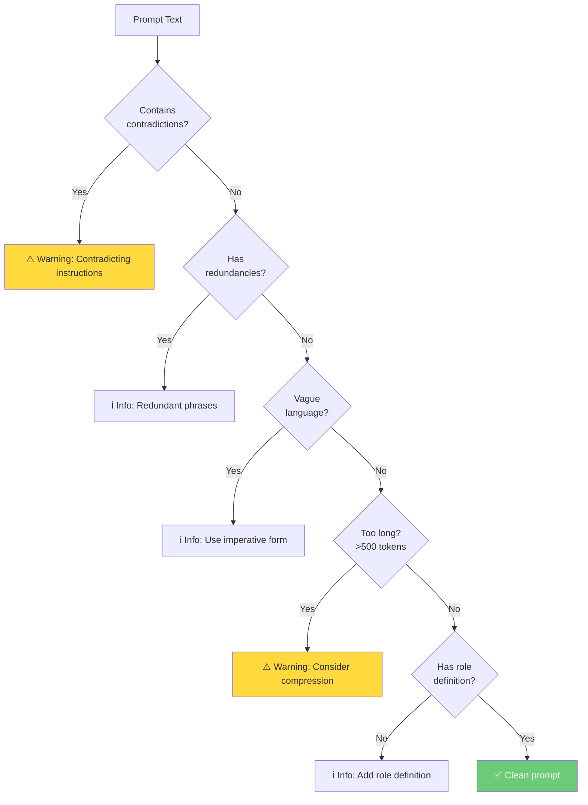

# PromptForge Architecture

## Compression Pipeline

## Version Control Flow

## Linting Decision Tree

## Cost Impact

```mermaid
xychart-beta
    title "Token Cost Before vs After PromptForge Optimization"
    x-axis ["System Prompt", "Tool Schemas", "History", "User Query", "Total"]
    y-axis "Tokens" 0 --> 8000
    bar [4200, 3000, 2500, 200, 9900]
    bar [1600, 3000, 1500, 200, 6300]
```

| Component | Before | After | Savings |
|-----------|--------|-------|---------|
| System Prompt | 4,200 | 1,600 | **62%** |
| History (windowed) | 2,500 | 1,500 | **40%** |
| Tool Schemas | 3,000 | 3,000 | 0% |
| **Total per request** | **9,900** | **6,300** | **36%** |
| **Monthly cost (10K req)** | **$247** | **$157** | **$90 saved** |
